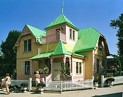

# Lektion: pippi

**Datum:** 2025-08-27

**Sammanfattning:** Tränat på taggarna h1, h2, p, ul-li, img

## Kod

### index.html
```html
<!DOCTYPE html>
<html lang="sv">
<head>
    <meta charset="UTF-8">
    <meta name="viewport" content="width=device-width, initial-scale=1.0">
    <title>Pippi Långstrump</title>
</head>
<body>
    <h1>Pippi Långstrump</h1>
    
    <p><strong>Pippi Långstrump</strong>, <em>Pippilotta Viktualia Rullgardina Krusmynta Efraimsdotter Långstrump</em>,[1] är en litterär figur av Astrid Lindgren som första gången förekom i boken med samma namn från 1945. Pippi skapades 1941 och är en av Lindgrens mest kända figurer. Pippi-böckerna finns översatta till 77 olika språk (2020).[2]</p>
    
    <p>Pippi är världens starkaste, har fräknar och röda flätor som står rakt ut, säger emot vuxna och är allmänt ouppfostrad. I början när böckerna kom ut kunde hon upplevas som kontroversiell. Hon bor utan föräldrar i ett hus kallat Villa Villekulla tillsammans med sin prickiga häst Lilla gubben och sin apa Herr Nilsson. Hon äter "krumelurpiller" (som gör att man aldrig blir stor), hennes mamma är i himlen, hennes pappa Efraim Långstrump är kung på söderhavsön Kurrekurreduttön och hon har en kappsäck full med guldpengar. I hennes trädgård finns ett ihåligt träd där det enligt Pippi växer sockerdricka. I böckerna om Pippi myntas begrepp såsom pluttifikationstabellen, spunk och sak-letare.</p>
    <h2>Historia</h2>
    <p>Vintern 1941 var Lindgrens sjuåriga dotter Karin sjuk i lunginflammation och sade till sin mor att hon ville höra en berättelse om Pippi Långstrump. Lindgren började berätta och berättelserna om Pippi roade både Karin och hennes vänner. När Lindgren en dag i mars 1944 stukade foten var hon tvungen att hålla sig i stillhet och under den tiden skrev hon ned berättelserna. Vid Karins 10-årsdag i maj 1944 fick hon de nedskrivna berättelserna i present.[3] Sonja Melin, en klasskamrat till Astrid Lindgrens dotter, stod som förebild för Pippi Långstrumps oblyga personlighet och utseende.[4][5][6]</p>
    <p>Efter att först ha blivit refuserad av Bonniers förlag gavs boken Pippi Långstrump ut av Rabén & Sjögren i november 1945. Denna följdes av ytterligare två romaner och ett flertal kortare berättelser och bilderböcker.</p>
    <p>För ytterligare information om den första bokens tillkomst, se Pippi Långstrump (bok).</p>
    <h2>Persongalleri</h2>
    <ul>
        <li><strong>Pippi Långstrump</strong>, böckernas huvudperson – den starkaste flickan i världen. Hon kan till och med lyfta sin häst <em>Lilla Gubben</em>.</li>
        <li><strong>Tommy och Annika Settergren</strong>, syskon, och Pippis grannar och bästa vänner. De är, i kontrast till Pippi, mer lydiga och prydliga. De försöker hitta balansen mellan att tillfredsställa föräldrarnas, sin egen och Pippis vilja.</li>
    </ul>
</body>
</html>
```


