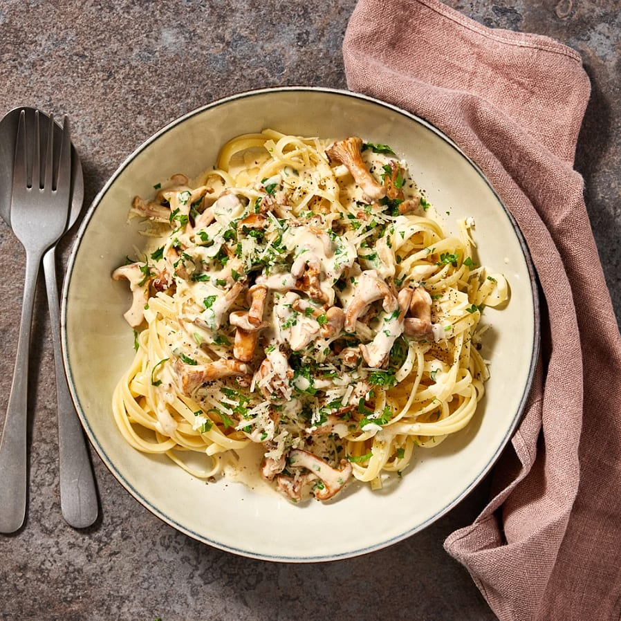
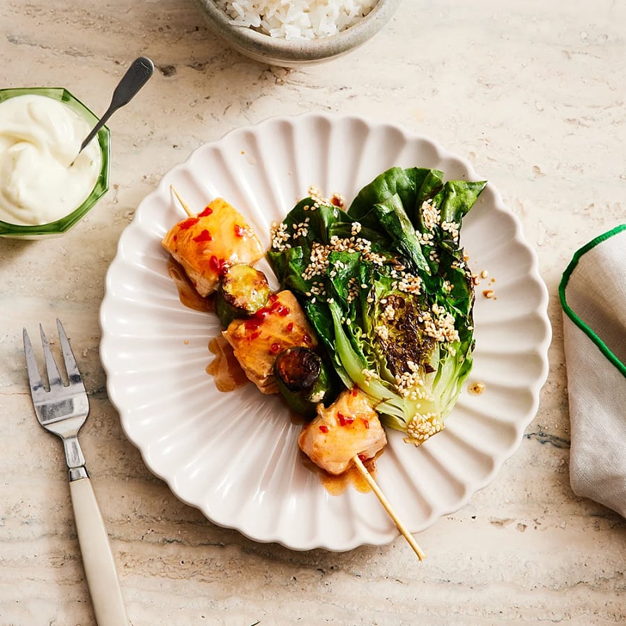
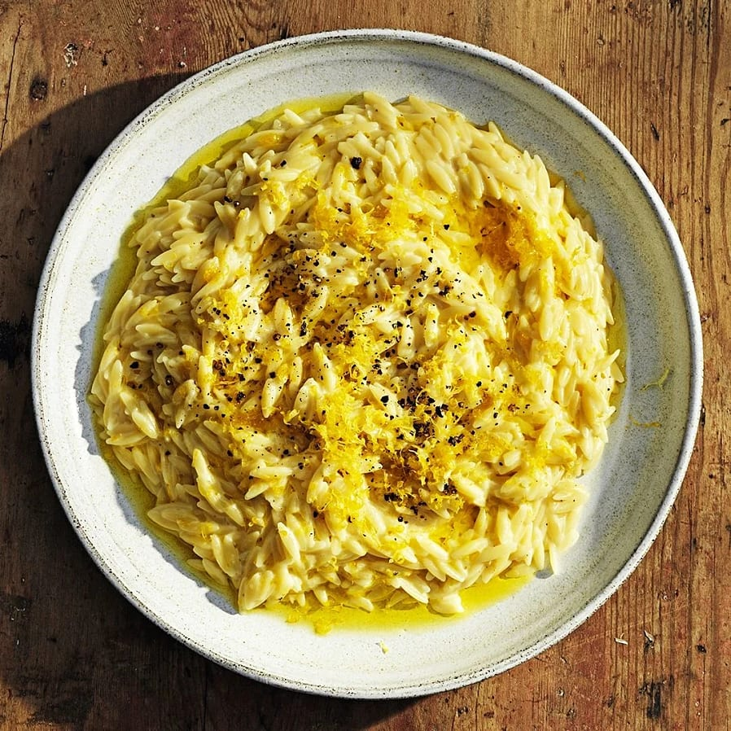
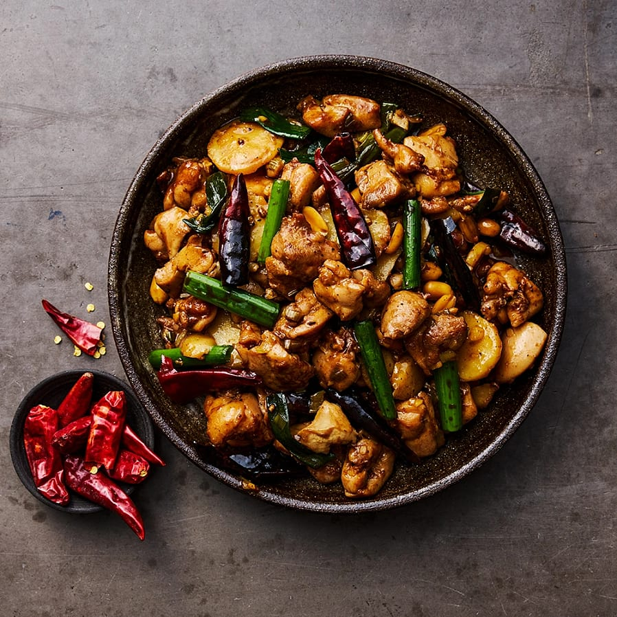

# Lektion: veckomeny

**Datum:** 2025-09-04

**Sammanfattning:** Tränat tabell, caption, tr, th/td, CSS: padding, margin:auto, border-spacing

## Kod

### index.html
```html
<!DOCTYPE html>
<html lang="en">
<head>
    <meta charset="UTF-8">
    <meta name="viewport" content="width=device-width, initial-scale=1.0">
    <title>Veckomeny</title>
    <link rel="stylesheet" href="style.css">
</head>
<body>
    <table>
        <caption>Veckomeny v36 - NTI</caption>
        <tr>
            <th>Måndag</th>
            <th>Tisdag</th>
            <th>Onsdag</th>
            <th>Torsdag</th>
            <th>Fredag</th>
        </tr>
        <tr>
            <td>Krämig kantarellpasta med parmesan</td>
            <td>Tonfisksallad med kikärtor och dijonnaise</td>
            <td>Sweet chiliglacerade laxspett med limeaioli</td>
            <td>Krämig citronrisoni</td>
            <td>Kung pao-kyckling med jordnötter och sichuanpeppar</td>
        </tr>
        <tr>
            <td></td>
            <td></td>
            <td></td>
            <td></td>
            <td></td>
        </tr>
    </table>
</body>
</html>
```

### style.css
```css
body {
    background-color: #ca9898;
}
table {
    width: 1000px;
    background-color: #DDD;
    border-spacing: 10px;
    margin: auto;
}
caption {
    background-color: #bebebe;
    background-image: url(./bilder/dagny-reese-tTM1K94ZzhE-unsplash.jpg);
    font-size: 50px;
    padding: 20px;
}
tr {

}
th {
    font-size: 25px;
    padding: 5px;
}
td {
    padding: 7px;
    border: 1px solid #CCC;
    border-radius: 5px;
    background-color: #fff;
}
img {
    width: 100%;
}
```


