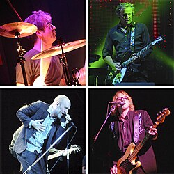

# Lektion: webbplats

**Datum:** 2025-11-06

**Sammanfattning:** Tränat på meny, hover-effekt, CSS-specificitet

## Kod

### sida1.html
```html
<!DOCTYPE html>
<html lang="en">
<head>
    <meta charset="UTF-8">
    <meta name="viewport" content="width=device-width, initial-scale=1.0">
    <title>Fem favoritband</title>
    <link rel="stylesheet" href="style.css">
</head>
<body>
    <div class="kontainer">
        <h1>Fem favoritband</h1>
        <div class="meny">
            <a class="aktiv" href="sida1.html">ABBA</a>
            <a href="sida2.html">REM</a>
            <a href="sida3.html">Midnight Oil</a>
            <a href="sida4.html">The Doors</a>
            <a href="sida5.html">Manfred Mann</a>
        </div>
        <figure>
            
            <figcaption>ABBA in 1974; from left: Benny Andersson, Anni-Frid "Frida" Lyngstad, Agnetha Fältskog, and Björn Ulvaeus</figcaption>
        </figure>
        <p>ABBA[a] (/ˈæbə/ ⓘ AB-ə [ˈâbːa]) were a Swedish pop group formed in Stockholm in 1972 by Agnetha Fältskog, Björn Ulvaeus, Benny Andersson, and Anni-Frid Lyngstad. They are among the most renowned and commercially successful musical groups in history.[3]</p>
        <p>In 1974, ABBA won the Eurovision Song Contest for Sweden with their song "Waterloo". In 2005, 'Waterloo" was chosen as the best song in the competition's history during its 50th anniversary celebration. During their peak, ABBA comprised two married couples: Fältskog and Ulvaeus, and Lyngstad and Andersson. As their fame grew, their personal lives suffered, leading to the dissolution of both marriages. These relationship changes were reflected in the group's later music, which featured darker and more introspective lyrics.[4] </p>
        <p>Bild och text <a href="https://en.wikipedia.org/wiki/ABBA">Wikipedia</a></p>
    </div>
</body>
</html>
```

### sida2.html
```html
<!DOCTYPE html>
<html lang="en">
<head>
    <meta charset="UTF-8">
    <meta name="viewport" content="width=device-width, initial-scale=1.0">
    <title>Fem favoritband</title>
    <link rel="stylesheet" href="style.css">
</head>
<body>
    <div class="kontainer">
        <h1>Fem favoritband</h1>
        <div class="meny">
            <a href="sida1.html">ABBA</a>
            <a class="aktiv" href="sida2.html">REM</a>
            <a href="sida3.html">Midnight Oil</a>
            <a href="sida4.html">The Doors</a>
            <a href="sida5.html">Manfred Mann</a>
        </div>
        <figure>
            
            <figcaption>Clockwise from top left: Bill Berry, Peter Buck, Mike Mills, Michael Stipe</figcaption>
        </figure>
        <p>R.E.M. was an American rock band formed in Athens, Georgia, in 1980 by drummer Bill Berry, guitarist Peter Buck, bassist Mike Mills, and lead vocalist Michael Stipe, who were students at the University of Georgia. R.E.M. was noted for Buck's arpeggiated "jangle" guitar playing; Stipe's distinctive vocal style, unique stage presence, and cryptic lyrics; Mills's countermelodic bass lines and backing vocals; and Berry's tight, economical drumming. In the early 1990s, other alternative rock acts such as Nirvana, Pixies, and Pavement named R.E.M. as a pioneer of the genre. After Berry left in 1997, the remaining members continued with mixed critical and commercial success. The band broke up amicably in 2011, having sold more than 90 million albums worldwide and becoming one of the world's best-selling music acts.</p>
        <p>Bild och text <a href="https://en.wikipedia.org/wiki/R.E.M.">Wikipedia</a></p>
    </div>
</body>
</html>
```

### sida3.html
```html
<!DOCTYPE html>
<html lang="en">
<head>
    <meta charset="UTF-8">
    <meta name="viewport" content="width=device-width, initial-scale=1.0">
    <title>Fem favoritband</title>
    <link rel="stylesheet" href="style.css">
</head>
<body>
    <div class="kontainer">
        <h1>Fem favoritband</h1>
        <div class="meny">
            <a href="sida1.html">ABBA</a>
            <a href="sida2.html">REM</a>
            <a class="aktiv" href="sida3.html">Midnight Oil</a>
            <a href="sida4.html">The Doors</a>
            <a href="sida5.html">Manfred Mann</a>
        </div>
        <figure>
            
            <figcaption>Midnight Oil at Vieilles Charrues Festival, 2022</figcaption>
        </figure>
        <p>Midnight Oil (known informally as "The Oils") are an Australian rock band composed of Peter Garrett (vocals, harmonica), Rob Hirst (drums), Jim Moginie (guitar, keyboard) and Martin Rotsey (guitar). The group was formed in Sydney in 1972 by Hirst, Moginie and original bassist Andrew James as Farm: they enlisted Garrett the following year, changed their name in 1976, and hired Rotsey a year later. Peter Gifford served as bass player from 1980 to 1987, with Bones Hillman then assuming the role until his death in 2020. Midnight Oil have sold over 20 million albums worldwide as of 2021.</p>
        <p>Bild och text <a href="https://en.wikipedia.org/wiki/Midnight_Oil">Wikipedia</a></p>
    </div>
</body>
</html>
```

### sida4.html
```html
<!DOCTYPE html>
<html lang="en">
<head>
    <meta charset="UTF-8">
    <meta name="viewport" content="width=device-width, initial-scale=1.0">
    <title>Fem favoritband</title>
    <link rel="stylesheet" href="style.css">
</head>
<body>
    <div class="kontainer">
        <h1>Fem favoritband</h1>
        <div class="meny">
            <a href="sida1.html">ABBA</a>
            <a href="sida2.html">REM</a>
            <a href="sida3.html">Midnight Oil</a>
            <a class="aktiv" href="sida4.html">The Doors</a>
            <a href="sida5.html">Manfred Mann</a>
        </div>
        <figure>
            
            <figcaption>The Doors c. 1966: Jim Morrison (left), John Densmore (center), Robby Krieger (right), and Ray Manzarek (seated)</figcaption>
        </figure>
        <p>The Doors were an American rock band formed in Los Angeles in 1965, comprising vocalist Jim Morrison, keyboardist Ray Manzarek, guitarist Robby Krieger, and drummer John Densmore. They were among the most influential and controversial rock acts of the 1960s, primarily due to Morrison's lyrics and voice, along with his erratic stage persona and legal issues. The group is widely regarded as an important figure of the era's counterculture.[4]</p>
        <p>Bild och text <a href="https://en.wikipedia.org/wiki/Midnight_Oil">Wikipedia</a></p>
    </div>
</body>
</html>
```

### sida5.html
```html
<!DOCTYPE html>
<html lang="en">
<head>
    <meta charset="UTF-8">
    <meta name="viewport" content="width=device-width, initial-scale=1.0">
    <title>Fem favoritband</title>
    <link rel="stylesheet" href="style.css">
</head>
<body>
    <div class="kontainer">
        <h1>Fem favoritband</h1>
        <div class="meny">
            <a href="sida1.html">ABBA</a>
            <a href="sida2.html">REM</a>
            <a href="sida3.html">Midnight Oil</a>
            <a href="sida4.html">The Doors</a>
            <a class="aktiv" href="sida5.html">Manfred Mann</a>
        </div>
        <figure>
            
            <figcaption>Manfred Mann år 1966. From left: Manfred Mann, Mike d'Abo, Klaus Voormann, Mike Hugg and Tom McGuinness.</figcaption>
        </figure>
        <p>Manfred Mann were an English rock band formed in London in 1962. They were named after their keyboardist Manfred Mann, who later led the successful 1970s group Manfred Mann's Earth Band.[4] The group had two lead vocalists: Paul Jones from 1962 to 1966 and Mike d'Abo from 1966 to 1969. Other members of various group line-ups were Mike Hugg, Mike Vickers, Dave Richmond, Tom McGuinness, Jack Bruce (later of Cream) and Klaus Voormann.</p>
        <p>Bild och text <a href="https://en.wikipedia.org/wiki/Midnight_Oil">Wikipedia</a></p>
    </div>
</body>
</html>
```

### style.css
```css
@import url('https://fonts.googleapis.com/css2?family=Chicle&family=Comfortaa:wght@300..700&display=swap');

/* Enkel CSS-reset */
html {
    box-sizing: border-box;
}
*, *:before, *:after {
    box-sizing: inherit;
}
body, h1, h2, h3, h4, h5, h6, p, ul {
    margin: 0;
    padding: 0;
}

:root {
    /* CSS HEX */
    --charcoal: #264653ff;
    --persian-green: #2a9d8fff;
    --saffron: #e9c46aff;
    --sandy-brown: #f4a261ff;
    --burnt-sienna: #e76f51ff;
}

body {
    background-color: var(--charcoal);
}
.kontainer {
    background-color: #fff;
    width: 900px;
    margin: auto;
    padding: 30px;
}
.kontainer h1 {
    font-family: "Chicle", serif;
    font-size: 80px;
    color: var(--burnt-sienna);
    margin-bottom: 40px;
    text-align: center;
}
.kontainer .meny {
    margin-bottom: 30px;
    text-align: center;
}
.kontainer .meny a {
    text-decoration: none;
    background-color: var(--sandy-brown);
    padding: 10px;
    width: 125px;
    display: inline-block;
    color: var(--charcoal);
    font-size: 12px;
    font-weight: bold;
    font-family: "Comfortaa", sans-serif;
}
.kontainer .meny a:hover {
    background-color: var(--burnt-sienna);
}
.kontainer .meny a.aktiv {
    background-color: var(--burnt-sienna);
}
.kontainer figure {
    border: 1px solid;
    width: 50%;
    margin: auto;
    padding: 30px;
    margin-bottom: 30px;
}
.kontainer figure img {
    width: 100%;
}
.kontainer figure figcaption {

}
.kontainer p {
    font-size: 20px;
    margin-bottom: 20px;
}
.kontainer p a {

}
```


